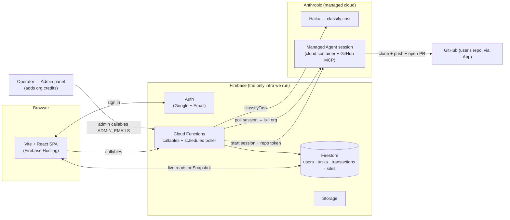
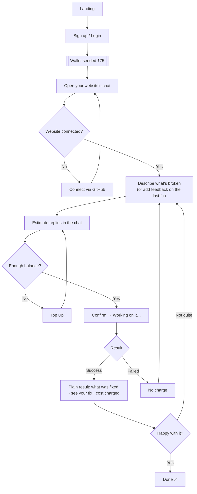
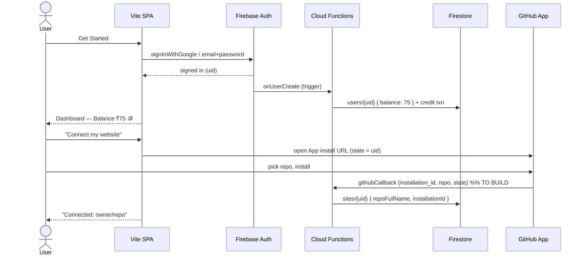
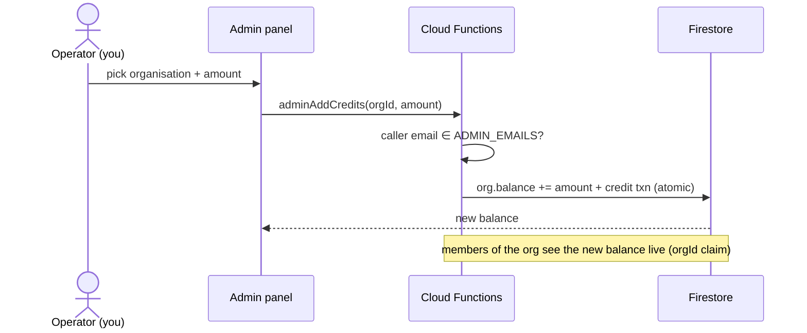
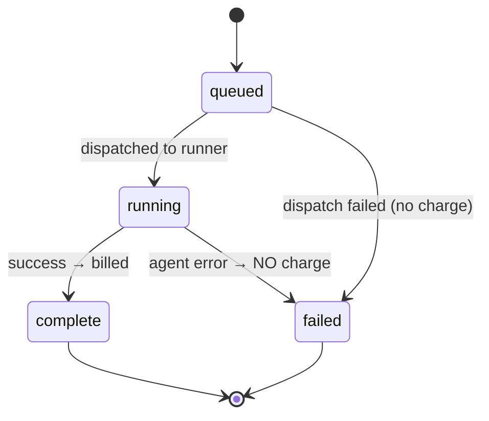

# Website Fixer — Flow & Architecture

How the pieces fit, what happens in what order, and who is allowed to touch money.

---

## 1. The big picture (components)



**No infrastructure of ours runs the agent** — it executes in Anthropic's managed cloud.
We only run Firebase. **Rule that drives the design:** the browser can *read* a user's own
data but can **never write money** (balance, cost, charge). Only Cloud Functions (Admin SDK)
write those.

---

## 2. User flow (the journey)



**The chat is a review-and-revise loop, not a live activity viewer.** One thread per
website. Each round that does work — first request or a revision — gets its own
estimate and its own agent session. The repo is cached by Anthropic, so re-fixes start
fast. Language stays plain; no code or diffs.

**Revision charging (fair model).** When a round is a revision, a quick Haiku check
classifies the feedback against the previous problem + result:
- *Same problem still unresolved* → **free re-fix** — we fell short. We still pay the
  agent cost, so free re-tries are capped (`FREE_RETRY_CAP`) per original problem.
- *New or expanded request* → fresh estimate + charge (min ₹75).

The charge decision is **server-authoritative** (`createTask` re-classifies; it never
trusts a client-supplied "it's unresolved"). A round carries `kind`
(`initial` / `unresolved` / `new_scope`), `parentTaskId`, and the parent tracks
`freeRetriesUsed`.

---

## 3. Sequence — sign up & connect a website



---

## 4. Sequence — the fix (classify → confirm → run → bill)

```mermaid
sequenceDiagram
  actor U as User
  participant Web as Vite SPA
  participant Fn as Cloud Functions
  participant Haiku as Anthropic (Haiku)
  participant FS as Firestore
  participant MA as Managed Agent (Anthropic cloud)
  participant GH as GitHub

  U->>Web: Describe problem → "Fix My Website"
  Web->>Fn: classifyTask(prompt)
  Fn->>Haiku: classify (~₹0.50, we absorb)
  Haiku-->>Fn: { complexity, reason }
  Fn-->>Web: estimate ₹min–₹max
  Web-->>U: Confirm (estimate + "3–5 min")

  U->>Web: "Yes, Fix It!"
  Web->>Fn: createTask(prompt, complexity)
  Fn->>FS: balance >= worst-case charge?  (else INSUFFICIENT_BALANCE)
  Fn->>FS: tasks/{id} { status: queued, billed: false }
  Fn->>Fn: mint GitHub App installation token (repo scope)
  Fn->>MA: start session (mount repo + token) + send problem
  MA-->>Fn: sessionId
  Fn->>FS: tasks/{id} { status: running, sessionId }
  Fn-->>Web: { taskId } → navigate to Running

  Web->>FS: subscribe tasks/{id} (live)
  MA->>GH: clone → fix → push branch → open PR (GitHub MCP)
  Note over Fn,MA: scheduled pollSessions watches the session;<br/>terminates it if cost exceeds the tier cap
  Fn->>MA: poll session status + usage + runtime
  MA-->>Fn: done · usage (tokens) · session runtime · PR url
  Fn->>FS: TXN — actual cost ×2 (min ₹75), deduct, mark billed
  Note over Fn,FS: atomic + idempotent · failures are NEVER charged
  FS-->>Web: status: complete, cost, new balance
  Web-->>U: "Your fix is ready ✅  Cost ₹X  Balance ₹Y"
```

### Billing (single source of truth — `shared/billing.js`)
```
actual_cost_usd = token cost (input/output/cache × model rate)
                + session runtime (hours) × $0.08            ← Managed Agents runtime charge
actual_cost_inr = actual_cost_usd × rate                     (backend-authoritative rate)
final_charge    = max( ceil(actual_cost_inr × 2), 75 )

complexity → tier cap → true max charge → balance required to start
  simple   0.45 USD   ₹75    ₹75
  medium   1.50 USD   ₹249   ₹249
  complex  3.00 USD   ₹498   ₹498

There is NO max_budget_usd parameter on Managed Agents. The poller enforces the cap
by terminating a session whose accrued cost crosses the tier ceiling.
```

---

## 5. Sequence — operator adds credits (no self-serve payment)

Credits live at the **organisation** level and are seeded by the operator from the
admin panel. No Razorpay in v1.



---

## 6. Task lifecycle (state machine)



---

## 7. Data model (Firestore)

| Collection | Doc id | Key fields | Who writes |
|---|---|---|---|
| `organisations` | auto | `name`, `balance` (the credit wallet) | admin callables + billing |
| `users` | `uid` | `email`, `role`, `orgId` | Functions only |
| `sites` | `uid` | `repoFullName`, `installationId` | `githubCallback` |
| `tasks` | auto | `orgId`, `userId`, `prompt`, `complexity`, `kind`, `status`, `billed`, `finalCharge`, `prUrl`, `filesChanged` | Functions only |
| `transactions` | auto | `orgId`, `type` (credit/debit), `amount`, `taskId` / `by` | Functions only |

Credits are **per-organisation**, seeded by the operator. A user is scoped to one org
via an `orgId` custom claim (set when the operator assigns them), which gates org +
transaction reads in the security rules.

---

## 8. What's built vs pending

| Piece | Status |
|---|---|
| SPA (8 pages), hooks, components | ✅ built, compiles |
| Functions: signup credit, classify, createTask, completeTask, Razorpay order + webhook | ✅ built, syntax-checked |
| Shared billing logic | ✅ built, unit-asserted |
| Security rules (Firestore + Storage) | ✅ built |
| `githubCallback` (write `sites/{uid}` after install) | ⏳ pending (needs the GitHub App created) |
| `mintInstallationToken` (GitHub App → repo token) | ✅ written, untested |
| `startFixSession` (Claude Managed Agent session) | ✅ written, untested (needs agent created + recent SDK) |
| One-time agent creation (model + GitHub MCP) | ⏳ pending (a setup script / Console) |
| `pollSessions` scheduled finalizer (read usage+runtime → bill, terminate over-budget) | ⏳ pending |
| Firebase project + deploy | ⏳ next, together |

## 9. Managed Agents specifics (Anthropic-hosted)

- **Beta:** all requests need header `managed-agents-2026-04-01` (the SDK sets it).
- **Agent** is created once (model + system + GitHub MCP server `https://api.githubcopilot.com/mcp/` + agent toolset) and reused by id.
- **Environment** = Anthropic-managed cloud container (we omit `environment_id`). *Not* our EC2.
- **Repo access** = session resource `github_repository` { url, mount_path, authorization_token }, where the token is a short-lived **GitHub App installation token** (`repo` scope) we mint per fix.
- **Async + stateful:** send the problem as a `user.message` event; the session streams via SSE and persists history server-side. We finalize via the scheduled poller, not a callback.
- **Cost:** tokens (model rates) + **$0.08/session-hour**. No spend-cap param → poller terminates over-budget sessions.
- **Not ZDR/HIPAA-eligible** while sessions persist; sessions/files are deletable via API.
```
