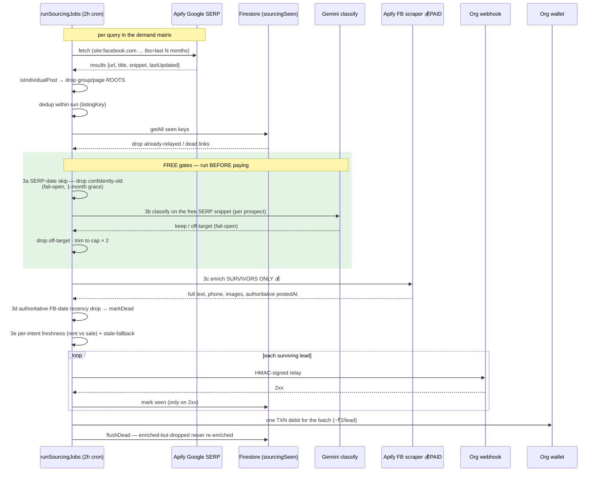

# Property Sourcing Relay — Sequence (vet-before-enrich)

The metered sourcing lane (`functions/handlers/runSourcingJobs.js`, 2-hourly cron). The design
principle is **vet cheaply, then pay**: every free gate (URL filter, dedup, coarse SERP date,
Gemini relevance on the free snippet) runs *before* the paid Facebook-post scrape, so only genuine,
in-window listings ever cost money to enrich.

## What changed vs the old flow

Previously the two green FREE gates ran *after* the 💰 enrich step: every fetched post was scraped,
then ~37% were discarded for being too old and ~29% for being off-target — **~3.7 paid scrapes per
relayed lead**. Moving both gates ahead of enrichment means only vetted, in-window listings hit the
paid scraper, targeting **~1.5–2 scrapes per lead** (cost/lead ~₹3.6 → ~₹1.8–2.2).

## The two date gates (why there are two)

| Gate | Source | Cost | Role |
|------|--------|------|------|
| **3a SERP-date skip** | Google's `lastUpdated` (present ~69% of posts) | free | Skip confidently-old posts before paying. Coarse (Google's last-seen-update, not the post date), so fail-open with a 1-month grace. |
| **3d FB-date drop** | FB scraper's authoritative `postedAt` | already paid | The real recency gate. Catches what 3a under-caught (the ~31% dateless posts + borderline). Marks stale posts dead so they're never re-enriched. |

## Log lines to watch (per target, one cron run)

- `serp-stale-skip {dropped, kept}` — free kills by the SERP date
- `classify {pool, kept}` — relevance gate (now pre-enrichment)
- `images {enriched}` — the **paid** scrape count (should be much lower now)
- `stale-drop {dropped}` — residual: what the cheap SERP date under-caught
- `intent-stale-drop {dropped, readmitted}` — per-intent freshness
- `done {relayed, amountInr}` — relayed + wallet debit

**Health ratio:** `enriched ÷ relayed` — was **3.7**, target **~1.5–2**.
